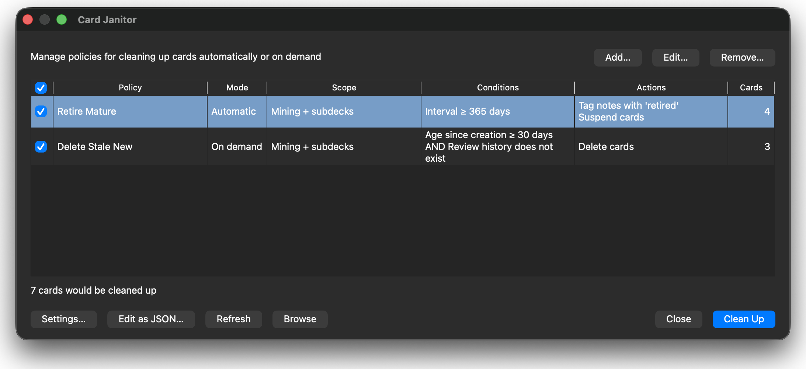

#  Card Janitor

Configurable policy-based cleanup for Anki cards.

Applies cleanup policies according to deck scope, age, interval, card state, or review history, either on demand or automatically once per day.

> [!WARNING]
> Card Janitor can make destructive collection changes, including permanently
> deleting cards. Back up your collection before use. Begin with **On demand**
> mode, inspect matching cards with **Browse**, and verify Anki's undo behavior
> before enabling automatic cleanup. You use this add-on at your own risk; its
> author accepts no responsibility or liability for collection damage or data loss.



## Installation

### Manual Installation

1. Download `card-janitor.ankiaddon` from the
   [latest GitHub release](https://github.com/zarnthyr/card-janitor/releases/latest).
2. Double-click the file, or open Anki and choose:

```text
Tools → Add-ons → Install from file...
```

3. Restart Anki if prompted.

### Install From Source

```bash
git clone https://github.com/zarnthyr/card-janitor.git
cd card-janitor
uv sync
make build
```

Then install `card-janitor.ankiaddon` from Anki's add-ons screen or by double clicking it.

## Policies

Each policy has three parts:

* Scope — one or more decks, optionally including subdecks
* Conditions — age, interval, card state, or review history, combined with AND/OR
* Actions — tag, suspend, move, or delete the qualifying cards

### Scope

Scope limits a policy to one or more decks. It can optionally include their
subdecks and cards that are already suspended. Filtered-deck cards are excluded.

### Conditions

> [!WARNING]
> Card-creation age is derived from the timestamp encoded in Anki's card ID. Imported
> cards commonly retain the original creator's timestamp; it is **not** the date the
> card was imported into your collection. A creation-age policy can therefore match an
> entire premade deck immediately. Use this condition only for cards whose provenance
> you understand, and preview it with **On demand** mode before enabling automatic
> actions.

| Condition | What it matches | Important detail |
| --- | --- | --- |
| Age since first review | Whole days since the card's first genuine answer | Cards without review history do not match |
| Age since creation | Whole days since the card's original creation timestamp | Imported cards may retain much older creation dates |
| Current interval | The card's current scheduled interval in days | Supports greater than, at least, exactly, at most, and less than comparisons |
| Card state | New, Learning, Review, or Relearning cards | One or more states can be selected |
| Review history | Whether the card has ever received a genuine answer | History remains after a studied card is reset to New |

A policy can require **all** conditions to match (AND), or allow **any** condition
to match (OR). Nested combinations such as `A AND (B OR C)` are not currently
supported.

### Actions

Matching cards can be:

* tagged — tags belong to notes, so sibling cards share them
* suspended
* moved to another existing deck
* deleted — deletion must be the policy's only action

Compatible actions from overlapping policies are combined. Cards are skipped
and reported when policies specify conflicting move destinations or combine
deletion with another action.

### Example policies

Card Janitor can, for example:

* delete cards that remain unstudied 30 days after their original creation
* suspend cards one year after their first review
* move mature cards to a retirement deck once their interval reaches 365 days

Use **Browse** in the policy manager to inspect the cards a policy currently
matches before running it.

## Policy Modes

| Mode       | Behavior                                                    |
| ---------- | ----------------------------------------------------------- |
| On demand  | Runs only when you start cleanup from Card Janitor          |
| Automatic  | Runs once per day without confirmation and can also be run on demand |

Automatic cleanup runs when a profile opens if it has not yet run that day, and when Anki's day changes while the application remains open. It does not use background polling. Its completion notification can be disabled independently.

## Configuration

Open the policy manager:

```text
Tools → Card Janitor…
Card Janitor → Add… or Edit…
```

The add-on ships with no policies, so installing it cannot modify a collection. Begin with an on-demand tag-and-suspend policy and open **Card Janitor…** to preview its results. The dashboard can open candidates in Anki's Browser or apply the configured actions.

Policies can be created and repaired in the manager. **Settings…** controls
notifications and debug logging. Its **Edit JSON…** button
opens the underlying configuration for advanced editing.

Policy definitions are stored in the current collection and sync with it, so
each profile has its own policies. Notification and debug settings are shared
across profiles on the same Anki installation. Automatic cleanup is tracked
separately for each profile.

Automatic deletion is supported but is never configured by default. It requires an explicit `delete_card` action with `mode: "automatic"` and runs without confirmation.

See [config.md](./docs/config.md) for the complete schema and examples.

## Known Limitations

* Tags belong to notes in Anki, so tagging a qualifying card tags its note and any sibling cards
* First-review age cannot recover review history that was deleted or omitted during import
* Anki does not store a reliable per-card timestamp for when a card was imported into the current collection
* Decks are configured by name, so renamed or missing decks cause that policy to fail closed
* Notification and debug settings are shared across Anki profiles on the same installation

## Development

See [development.md](./docs/development.md) for setup, testing, and packaging notes.

## Attribution

Anki:
Ankitects Pty Ltd and contributors

## License

GNU AGPL v3 or later.\
See [LICENSE](./LICENSE).

## Info

Repository: https://github.com/zarnthyr/card-janitor

Issue tracker: https://github.com/zarnthyr/card-janitor/issues
